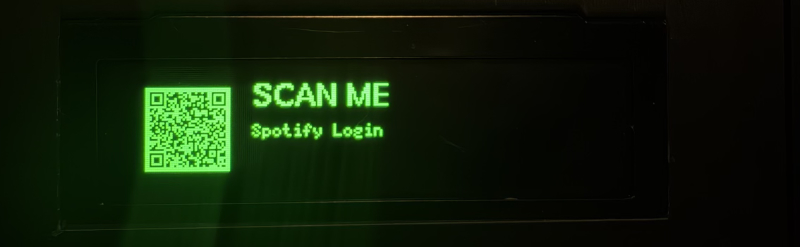
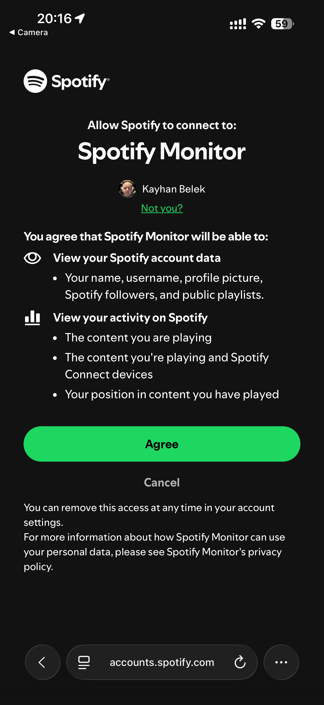

# ESP32 Spotify Remote & OLED Display 🎵

A feature-rich Spotify controller based on ESP32-S3, featuring an OLED display, Rotary Encoder navigation, and a secure "Relay Server" authentication flow.


*Scan the QR code on the OLED to authenticate securely.*

## Features 🚀

*   **Now Playing Info:** Displays Artist, Song, Progress Bar, and Time.
*   **Full Control:** Play/Pause, Next Track, Previous Track via Rotary Encoder.
*   **Menu System:** Adjustable Font Sizes, Screen Brightness, and Screensaver Timeout.
*   **Burn-in Protection:** "Bouncing Clock" screensaver activates when idle/paused.
*   **Real-time Clock:** Syncs time via NTP (GMT+3 default).
*   **Persistent Settings:** Saves all preferences (Fonts, Brightness, etc.) to flash memory.
*   **Secure Auth:** Uses a PHP Relay Server to handle Spotify OAuth2 (Client Secret is never stored on the ESP32).

## Hardware 🛠️

*   **ESP32-S3** (N16R8 or similar)
*   **SSD1322 OLED Display** (256x64) via SPI
*   **Rotary Encoder** (KY-040 or similar)

**Pinout (Configurable in `Globals.h`):**
*   **OLED:** CLK=4, MOSI=6, CS=7, DC=15, RES=16
*   **Encoder:** CLK=1, DT=3, SW=5

---

## Usage Guide

You can use this project in two ways: **Quick Start** (using my public relay server) or **Self-Hosted** (your own private backend).

### Option 1: Quick Start (Easiest) ⚡

Use the pre-configured server to get started immediately.

1.  **Flash the Firmware:**
    *   Open `newspotify` folder in PlatformIO (VS Code).
    *   Upload the code to your ESP32.
2.  **Connect WiFi:**
    *   On first boot, the device creates a WiFi Hotspot named `ESP32-Spotify`.
    *   Connect to it and enter your home WiFi credentials.
3.  **Authenticate:**
    *   The screen will display a **QR Code**.
    *   Scan it with your phone. It will take you to the authorization page.
    *   **Grant Permission:** Click "Agree" to allow the device to control your playback.
    *   
4.  **Enjoy:** The device will automatically reboot and start controlling your music!

### Option 2: Self-Hosted (Advanced) 🏠

If you prefer complete privacy and control, you can host the PHP backend yourself.

#### 1. Spotify App Setup
1.  Go to the [Spotify Developer Dashboard](https://developer.spotify.com/dashboard/).
2.  Create a new App.
3.  Note down your **Client ID** and **Client Secret**.
4.  In the App Settings, add a **Redirect URI**:
    *   `http://<your-server-ip-or-domain>/callback.php`
    *   Example: `http://localhost:8787/callback.php` or `https://my-domain.com/spotify/callback.php`

#### 2. Deploy Backend
The `backend_php` folder contains the relay server.

*   **Using Docker (Recommended):**
    1.  Edit `backend_php/config.php` and enter your `SPOTIFY_CLIENT_ID`, `SPOTIFY_CLIENT_SECRET`, and `REDIRECT_URI`.
    2.  Run `docker-compose up -d` inside the folder.
*   **Using Standard PHP:**
    1.  Upload the files to your PHP server (Apache/Nginx).
    2.  Ensure the `tokens/` directory is writable (`chmod 777 tokens`).
    3.  Edit `config.php` with your credentials.

#### 3. Update Firmware
1.  Open `newspotify/Globals.cpp`.
2.  Change the `relay_base_url` to point to your new server:
    ```cpp
    ```cpp
    const char *relay_base_url = "http://<your-server-ip>:8787";
    ```
3.  Re-upload the firmware to the ESP32.

---

## License

Free to use and modify!
